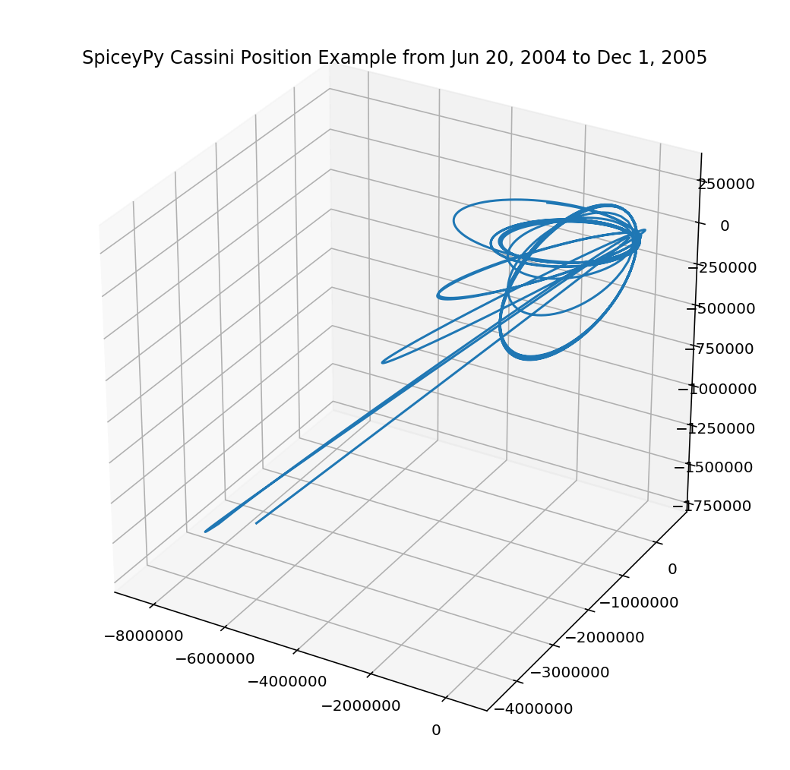

========================
Cassini Position Example
========================

Below is an example that uses spiceypy to plot the position of the
Cassini spacecraft relative to the barycenter of Saturn.

.. code:: python

    import numpy as np
    import matplotlib.pyplot as plt
    from mpl_toolkits.mplot3d import Axes3D

First import spiceypy and test it out.

.. code:: python

    import spiceypy as spice

.. code:: python

    # Print out the toolkit version
    spice.tkvrsn("TOOLKIT")

.. parsed-literal::

    'CSPICE_N0066'

We will need to load some kernels. You will need to download the following kernels
from the NAIF servers via the links provided. After the kernels have been downloaded
to a common directory write a metakernel containing the file names for each downloaded
kernel (provided after the links).
I named the metakernel 'cassMetaK.txt' for this example. For more on defining
meta kernels in spice, please consult the `Kernel Required Reading <https://naif.jpl.nasa.gov/pub/naif/misc/toolkit_docs_N0067/C/req/kernel.html>`_.

- `naif0009.tls <https://naif.jpl.nasa.gov/pub/naif/generic_kernels/lsk/a_old_versions/naif0009.tls>`_
- `cas00084.tsc <https://naif.jpl.nasa.gov/pub/naif/CASSINI/kernels/sclk/cas00084.tsc>`_
- `cpck05Mar2004.tpc <https://naif.jpl.nasa.gov/pub/naif/CASSINI/kernels/pck/cpck05Mar2004.tpc>`_
- `cas_v37.tf <https://naif.jpl.nasa.gov/pub/naif/CASSINI/kernels/fk/release.11/cas_v37.tf>`_
- `04135_04171pc_psiv2.bc <https://naif.jpl.nasa.gov/pub/naif/CASSINI/kernels/ck/04135_04171pc_psiv2.bc>`_
- `030201AP_SK_SM546_T45.bsp <https://naif.jpl.nasa.gov/pub/naif/CASSINI/kernels/spk/030201AP_SK_SM546_T45.bsp>`_
- `cas_iss_v09.ti <https://naif.jpl.nasa.gov/pub/naif/CASSINI/kernels/ik/release.11/cas_iss_v09.ti>`_
- `020514_SE_SAT105.bsp <https://naif.jpl.nasa.gov/pub/naif/CASSINI/kernels/spk/020514_SE_SAT105.bsp>`_
- `981005_PLTEPH-DE405S.bsp <https://naif.jpl.nasa.gov/pub/naif/CASSINI/kernels/spk/981005_PLTEPH-DE405S.bsp>`_

.. code:: python

    # The meta kernel file contains entries pointing to the following SPICE kernels, which the user needs to download.
    #   https://naif.jpl.nasa.gov/pub/naif/generic_kernels/lsk/a_old_versions/naif0009.tls
    #   https://naif.jpl.nasa.gov/pub/naif/CASSINI/kernels/sclk/cas00084.tsc
    #   https://naif.jpl.nasa.gov/pub/naif/CASSINI/kernels/pck/cpck05Mar2004.tpc
    #   https://naif.jpl.nasa.gov/pub/naif/CASSINI/kernels/fk/release.11/cas_v37.tf
    #   https://naif.jpl.nasa.gov/pub/naif/CASSINI/kernels/ck/04135_04171pc_psiv2.bc
    #   https://naif.jpl.nasa.gov/pub/naif/CASSINI/kernels/spk/030201AP_SK_SM546_T45.bsp
    #   https://naif.jpl.nasa.gov/pub/naif/CASSINI/kernels/ik/release.11/cas_iss_v09.ti
    #   https://naif.jpl.nasa.gov/pub/naif/CASSINI/kernels/spk/020514_SE_SAT105.bsp
    #   https://naif.jpl.nasa.gov/pub/naif/CASSINI/kernels/spk/981005_PLTEPH-DE405S.bsp
    #
    #   The following is the contents of a metakernel that was saved with
    #   the name 'cassMetaK.txt'.
    #   \begindata
    #   KERNELS_TO_LOAD=(
    #   'naif0009.tls',
    #   'cas00084.tsc',
    #   'cpck05Mar2004.tpc',
    #   '020514_SE_SAT105.bsp',
    #   '981005_PLTEPH-DE405S.bsp',
    #   '030201AP_SK_SM546_T45.bsp',
    #   '04135_04171pc_psiv2.bc',
    #   'cas_v37.tf',
    #   'cas_iss_v09.ti')
    #   \begintext
    #

    spice.furnsh("./cassMetaK.txt")

.. code:: python

    step = 4000
    # we are going to get positions between these two dates
    utc = ["Jun 20, 2004", "Dec 1, 2005"]

    # get et values one and two, we could vectorize str2et
    etOne = spice.str2et(utc[0])
    etTwo = spice.str2et(utc[1])
    print("ET One: {}, ET Two: {}".format(etOne, etTwo))

.. parsed-literal::

    ET One: 140961664.18440723, ET Two: 186667264.18308285

.. code:: python

    # get times
    times = [x * (etTwo - etOne) / step + etOne for x in range(step)]

    # check first few times:
    print(times[0:3])

.. parsed-literal::

    [140961664.18440723, 140973090.5844069, 140984516.98440656]

.. code:: python

    # check the documentation on spkpos before continuing
    help(spice.spkpos)

.. parsed-literal::

    Help on function spkpos in module spiceypy.spiceypy:

    spkpos(targ: str, et: Union[float, numpy.ndarray], ref: str, abcorr: str, obs: str) -> Union[Tuple[numpy.ndarray, float], Tuple[numpy.ndarray, numpy.ndarray]]
        Return the position of a target body relative to an observing
        body, optionally corrected for light time (planetary aberration)
        and stellar aberration.

        https://naif.jpl.nasa.gov/pub/naif/misc/toolkit_docs_N0067/C/cspice/spkpos_c.html

        :param targ: Target body name.
        :param et: Observer epoch.
        :param ref: Reference frame of output position vector.
        :param abcorr: Aberration correction flag.
        :param obs: Observing body name.
        :return:
                Position of target,
                One way light time between observer and target.

.. code:: python

    # Run spkpos as a vectorized function
    positions, lightTimes = spice.spkpos(
        "Cassini", times, "J2000", "NONE", "SATURN BARYCENTER"
    )

    # Positions is a 3xN vector of XYZ positions
    print("Positions: ")
    print(positions[0])

    # Light times is a N vector of time
    print("Light Times: ")
    print(lightTimes[0])

.. parsed-literal::

    Positions:
    [-5461446.61080924 -4434793.40785864 -1200385.93315424]
    Light Times:
    23.8062238783

.. code:: python

    # Clean up the kernels
    spice.kclear()

We will use matplotlib's 3D plotting to visualize Cassini's coordinates. We first convert the
positions list to a 2D numpy array for easier indexing in the plot.

.. code:: python

    positions = (
        positions.T
    )  # positions is shaped (4000, 3), let's transpose to (3, 4000) for easier indexing
    fig = plt.figure(figsize=(9, 9))
    ax = fig.add_subplot(111, projection="3d")
    ax.plot(positions[0], positions[1], positions[2])
    plt.title("SpiceyPy Cassini Position Example from Jun 20, 2004 to Dec 1, 2005")
    plt.show()

